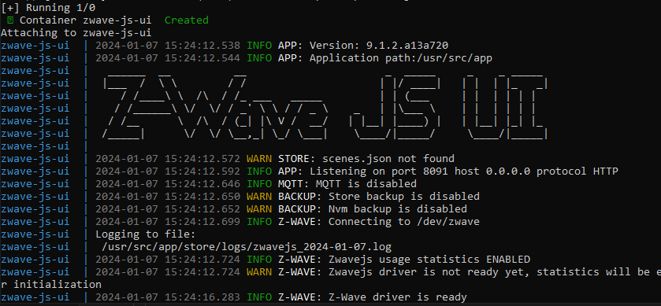
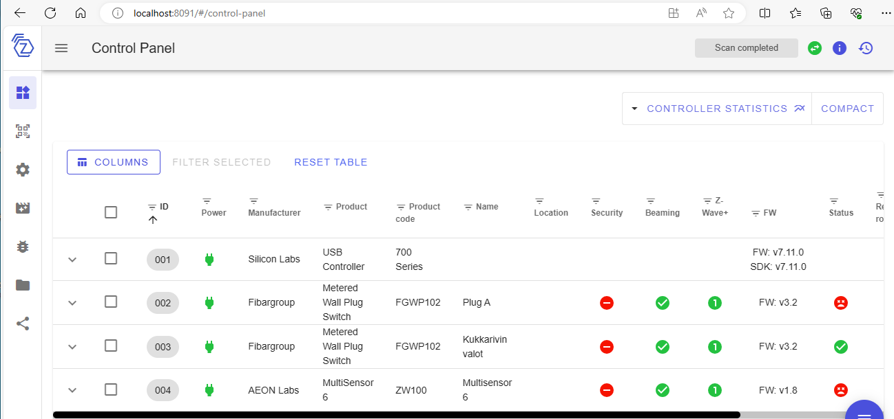
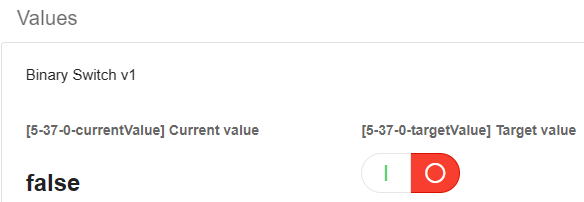
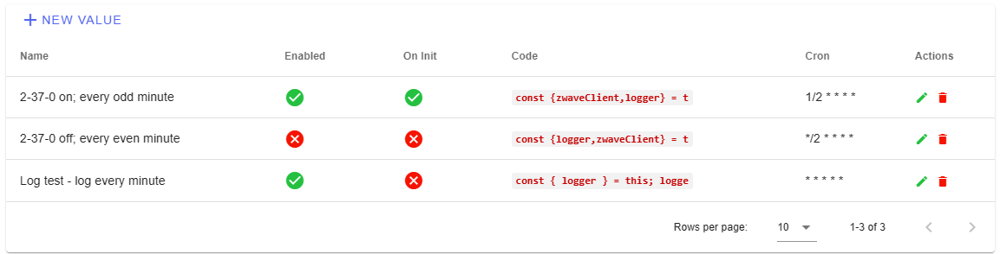
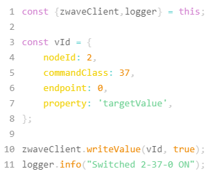
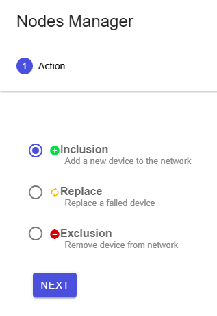

# My ZWave

This used to be called "MyHomeAssistant", but I have the feel HA is not really welcome in the equation. I just need it for scheduling, and it comes with ... so much. :/

Thus changing the title.

Running [Home Assistant](https://www.home-assistant.io) within Docker, under Windows 10 Home.

## Design criteria

### Safety

I don't want to give the Docker container `privileged: true` rights (i.e. ability to do anything
with the host Windows), or `networking: host` for that matter, either.

Instead, we bridge the dongle to WSL using USB/IP. ZWave-JS-UI takes care of handling the peripherals.

### Persistence

`./store` folder is used for the state of `zwave-js-ui`, so that is on the WSL file system instead of within the container.

## Requires

- WSL2 (requirement also for Docker)
- [`usbipd-win`](https://github.com/dorssel/usbipd-win) installed


## Steps

1. Expose Z-Wave dongle to WSL

   I'm using [Silicon Labs UZB-7](https://www.silabs.com/development-tools/wireless/z-wave/efr32zg14-usb-7-z-wave-700-stick-bridge-module) 

   In Admin command line:

   ```
   PS> usbipd list
   Connected:
   BUSID  VID:PID    DEVICE                                                        STATE
   3-1    10c4:ea60  Silicon Labs CP210x USB to UART Bridge (COM4)                 Not shared
   [...]
   ```

   ```
   PS> usbipd bind -b 3-1
   ```

   ```
   PS> usbipd attach --wsl -b 3-1
   usbipd: info: Using WSL distribution 'Ubuntu' to attach; the device will be available in all WSL 2 distributions.
   usbipd: info: Using IP address 172.25.32.1 to reach the host.
   ```

   Within WSL, see that the device is seen:

   ```
   $ lsusb
   Bus 001 Device 002: ID 10c4:ea60 Silicon Labs CP210x UART Bridge
   [...]
   ```

2. Launch the Docker container

   ```
   $ docker compose up zwave-js-ui
   ```

      

   Leave the software running.

3. Open [localhost:8091](http://localhost)

   
   
   >In Z-Wave, the controller remembers the devices it's been paired with.

4. Attach the devices

   <font color=red>tbd. Missing</font>

5. `Control Panel` > (device) > `Values`

   

   Note the `5-37-0` id - you can use it to script the particular device.

   >Note: Press `Configure` > `Get` if the above doesn't show.

6. `Settings` > `General` > `Scheduled jobs`

   

   >NOTE!! When you do changes here - or ANY Zwave-JS-UI settings, THEY DON*T REMAIN EFFECTIVE UNLESS YOU PRESS `SAVE` AT THE BOTTOM OF THE PAGE. MAKE IT A HABIT!

   - `+ NEW VALUE`
   - Enter suitable name, cron syntax and as the script e.g. 

   

   >Note: Naturally, use the id's from the visit to the control panel, e.g. `5`, `37`, `0`.

7. `Settings` > `Disable MQTT Gateway`

   Doesn't matter but we don't need it.

7. `Debug`

   Observe that the schedules happen.

## Gotchas

### Editing scripts

You *can* edit scripts, but it has some glitches / UX weirdness:

- Cursor seems to disappear when it's at the left edge (merges with the border)

   Work-around: indent *all* lines with one space!

- Read `EDIT` button as "save". That's what it does.

- After the "edit-save", STILL REMEMBER TO `SAVE` the whole `Settings` > `General` tab, before exiting the `Settings` area. THE UI DOES LOSE UNCHANGED CHANGES!

>Note. Don't know what happens if there are syntax errors in  

## Summary?

Having explored ZWave a bit, the author is:

- pleased with ZWave-JS-UI, at least for:
   - detecting and managing ZWave nodes

- ..knows that the nodes can be automated with it, but **with restrictions**
   - there's no good reference on how to write a "driver" (scheduled command) for a said device. 
   - there's no visual indication if a string is syntactically correct, or not
   - UX details (mentioned above) about editing schedules make it a bit.. unpleasant

For these reasons, I will likely

- set up the system with this *for now*. 
- look into ZWave command-line scheduling possibilities, using Rust.

There was no need for Home Assistant, whatsoever. It could be removed from the `docker-compose.yml`; or you could tell, how the two can be made to co-operate.

## Appendices

Things to help. Notes.

## Usability hint

The hamburger menu at lower right corner **changes based on which left-side tab you're on!!** This may be confusing at best.

## Adding devices

To add a device:

- Select "Control panel" (default view) from left tab
- Open `☰` > `Manage nodes`

   

- Enter the names; triple-click the device once the UI waits for inclusion. Should be fast and clear.

## Remember to update!

Docker doesn't automatically pull `:latest`. Every now and then:

- `docker compose down`
- Pull new from Docker UI, or manually
- `docker compose up zwave-js-ui`

Only way to get updates!

## References

- Home Assistant docs > Alternative > [Docker Compose](https://www.home-assistant.io/installation/alternative/#docker-compose)

- [Installing Home Assistant on Docker, Docker Compose and Portainer](https://www.youtube.com/watch?v=3ayI--eot4o) (Youtube, Aug 2022; 10:33)

- [Any way to schedule simple commands?](https://github.com/zwave-js/zwave-js-ui/issues/3507) (`zwave-js-ui` GitHub Discussion; Jan 2024)
